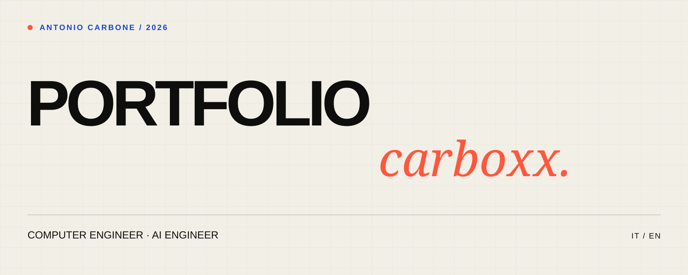

<p align="center">
  
</p>

<h1 align="center">Antonio Carbone — Portfolio</h1>

<p align="center">
  Personal website of Antonio Carbone, Computer Engineer and AI Engineer.<br />
  <a href="https://www.antoniocarbone.com"><strong>antoniocarbone.com ↗</strong></a>
</p>

## About

This repository contains the source code of my current portfolio. It brings together my professional experience, education, selected projects and the experiences that shaped the way I work.

The opening conversation introduces the essential context before the main page unfolds into an editorial, scroll-driven layout. The website is available in Italian and English and adapts its initial language to the visitor's browser settings.

## Built with

- [Next.js](https://nextjs.org/) and [React](https://react.dev/)
- TypeScript
- GSAP and ScrollTrigger for transitions and scroll choreography
- Custom CSS and locally hosted typefaces
- Structured metadata, canonical URLs and language alternatives

## Run locally

```bash
npm install
npm run dev
```

Open [http://localhost:3000](http://localhost:3000).

For a production check:

```bash
npm run check
npm run build
```

## Project structure

```text
app/                  Routes, metadata and global styles
components/           Portfolio UI and motion
public/               Images, fonts and downloadable CV
middleware.ts         Locale detection and preference handling
```

## Implementation notes

- Motion is progressively reduced when the visitor enables `prefers-reduced-motion`.
- The layout is responsive without maintaining a separate mobile experience.
- Personal information is defined in the portfolio component and rendered consistently across both locales.
- The interface uses semantic regions, descriptive labels and keyboard-visible interactive states.

## Contact

- [LinkedIn](https://www.linkedin.com/in/antoniocarbone97)
- [GitHub](https://github.com/carboxx)
- [Email](mailto:a.carbone613@gmail.com)

## License

The source code is available under the [MIT License](./LICENSE). Personal text, photographs, documents and identity assets remain © Antonio Carbone.
